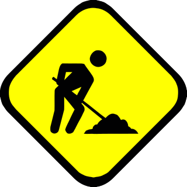

# G- Utilitaires / Listes

:::::{div} full-width

::::{grid} 4

:::{grid-item-card}
:link: J-Logiciel/G-J-Logiciel.html
:class-header: bg-light
**J** - Logiciel

^^^

```{figure} Docs/G-J.png
---
width: 75%
name: G-J-icon
---

```


+++



:::

:::{grid-item-card} 
:link: K-Technique/G-K-Technique.html
:class-header: bg-light

**K** - Technique
^^^

```{figure} Docs/G-K.png
---
width: 75%
name: G-K-icon
---

```


+++


:::

:::{grid-item-card}
:link: L-Listes/G-L-Listes.html
:class-header: bg-light
**L** - Listes

^^^


```{figure} Docs/G-L.png
---
width: 75%
name: G-L-icon
---

```


+++


:::

:::{grid-item-card}
:link: M-Cession-Officine/G-M-Cession-Officine.html
:class-header: bg-light
**M** - Cession Officine


^^^


```{figure} Docs/G-M.png
---
width: 75%
name: G-M-icon
---

```


+++


:::

::::

::::{grid} 4

:::{grid-item-card}
:link: N-TDB-Segur/G-N-TDB-Segur.html
:class-header: bg-light
**N** - TDB Segur

^^^


```{figure} Docs/G-N.png
---
width: 75%
name: G-N-icon
---

```


+++


:::

::::


:::::